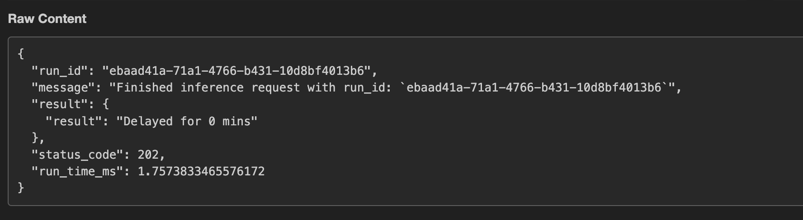

# Webhook Endpoints for Async and Long Running Tasks

This guide presents a short example on how to use webhook endpoints for async and long running tasks on Cerebrium.

Webhook endpoints are especially useful when you have tasks that will run for more than the 3 min timeout limit on
Cerebrium. This allows you to run longer, more demanding tasks on our platform!

## 1. Getting a webhook endpoint to test:

To obtain a webhook endpoint for testing, visit the [webhook.site](https://webhook.site/) and copy the url you're given.

This will provide you with a free, temporary endpoint which will receive the results from your model's predictions on
Cerebrium. Copy this url for use later.

## 2. Deploy a model

For this example, we provide a simple delay script to serve as your deployment.
Deploy the Cortex deployment in `delay` with the command

```bash
cerebrium deploy webhook-delay-example --config-file config.yaml
```

## 3. Making a request using the webhook endpoint:

When you make an inference request and want the results to be sent to a webhook endpoint, simply add the
parameter `webhook_endpoint` to your request data.

For example:

```bash
curl -X POST https://run.cerebrium.ai/v3/p-1234567/webhook-delay-example/predict \
     -H 'Content-Type: application/json' \
     -H 'Authorization: public-xxxxxxxxxxxxxxx' \
     --data '{"delayMins": 0, "webhook_endpoint": "https://webhook.site/your-webhook-endpoint-you-got-here"}'
```

You should receive a response from Cerebrium as soon as your request is registered saying:

```bash
"message":"Your request is being processed. We will return the result to your webhook."
```

You can then monitor the webhook site dashboard to visualize the asynchronous task output which should look as follows:



Congratulations, you've run your first async task on Cerebrium! 🚀

