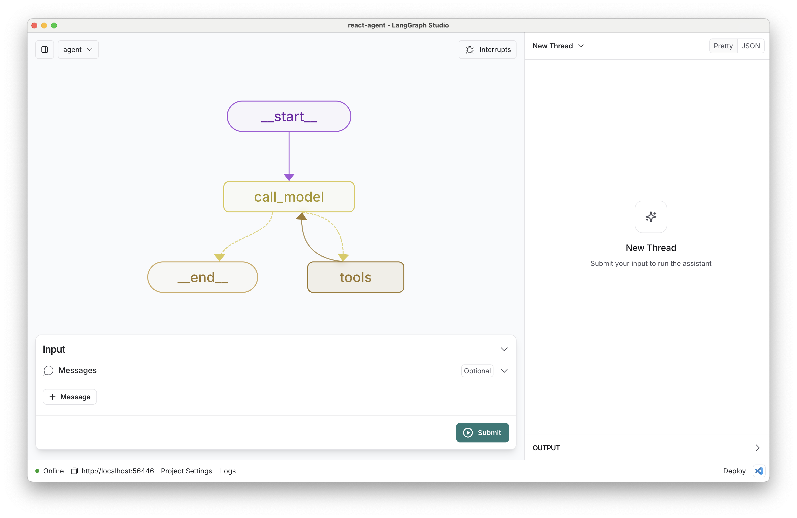

## Deploy to Cerebrium

This uses the langraph react-agent template as a base and uses fastAPI to serve the requests. You can find the FastAPI server in src/server.py

1. First, rename `.env.example` to `.env` and add your API keys:
2. Run `cerebrium deploy` to deploy the FastAPI server to Cerebrium
3. Interact with your FastAPI

# LangGraph ReAct Agent Template

[](https://github.com/langchain-ai/react-agent/actions/workflows/unit-tests.yml)
[](https://github.com/langchain-ai/react-agent/actions/workflows/integration-tests.yml)
[![Open in - LangGraph Studio](https://img.shields.io/badge/Open_in-LangGraph_Studio-00324d.svg?logo=data:image/svg%2bxml;base64,PHN2ZyB4bWxucz0iaHR0cDovL3d3dy53My5vcmcvMjAwMC9zdmciIHdpZHRoPSI4NS4zMzMiIGhlaWdodD0iODUuMzMzIiB2ZXJzaW9uPSIxLjAiIHZpZXdCb3g9IjAgMCA2NCA2NCI+PHBhdGggZD0iTTEzIDcuOGMtNi4zIDMuMS03LjEgNi4zLTYuOCAyNS43LjQgMjQuNi4zIDI0LjUgMjUuOSAyNC41QzU3LjUgNTggNTggNTcuNSA1OCAzMi4zIDU4IDcuMyA1Ni43IDYgMzIgNmMtMTIuOCAwLTE2LjEuMy0xOSAxLjhtMzcuNiAxNi42YzIuOCAyLjggMy40IDQuMiAzLjQgNy42cy0uNiA0LjgtMy40IDcuNkw0Ny4yIDQzSDE2LjhsLTMuNC0zLjRjLTQuOC00LjgtNC44LTEwLjQgMC0xNS4ybDMuNC0zLjRoMzAuNHoiLz48cGF0aCBkPSJNMTguOSAyNS42Yy0xLjEgMS4zLTEgMS43LjQgMi41LjkuNiAxLjcgMS44IDEuNyAyLjcgMCAxIC43IDIuOCAxLjYgNC4xIDEuNCAxLjkgMS40IDIuNS4zIDMuMi0xIC42LS42LjkgMS40LjkgMS41IDAgMi43LS41IDIuNy0xIDAtLjYgMS4xLS44IDIuNi0uNGwyLjYuNy0xLjgtMi45Yy01LjktOS4zLTkuNC0xMi4zLTExLjUtOS44TTM5IDI2YzAgMS4xLS45IDIuNS0yIDMuMi0yLjQgMS41LTIuNiAzLjQtLjUgNC4yLjguMyAyIDEuNyAyLjUgMy4xLjYgMS41IDEuNCAyLjMgMiAyIDEuNS0uOSAxLjItMy41LS40LTMuNS0yLjEgMC0yLjgtMi44LS44LTMuMyAxLjYtLjQgMS42LS41IDAtLjYtMS4xLS4xLTEuNS0uNi0xLjItMS42LjctMS43IDMuMy0yLjEgMy41LS41LjEuNS4yIDEuNi4zIDIuMiAwIC43LjkgMS40IDEuOSAxLjYgMi4xLjQgMi4zLTIuMy4yLTMuMi0uOC0uMy0yLTEuNy0yLjUtMy4xLTEuMS0zLTMtMy4zLTMtLjUiLz48L3N2Zz4=)](https://langgraph-studio.vercel.app/templates/open?githubUrl=https://github.com/langchain-ai/react-agent)

This template showcases a [ReAct agent](https://arxiv.org/abs/2210.03629) implemented using [LangGraph](https://github.com/langchain-ai/langgraph), designed for [LangGraph Studio](https://github.com/langchain-ai/langgraph-studio). ReAct agents are uncomplicated, prototypical agents that can be flexibly extended to many tools.



The core logic, defined in `src/react_agent/graph.py`, demonstrates a flexible ReAct agent that iteratively reasons about user queries and executes actions, showcasing the power of this approach for complex problem-solving tasks.

## What it does

The ReAct agent:

1. Takes a user **query** as input
2. Reasons about the query and decides on an action
3. Executes the chosen action using available tools
4. Observes the result of the action
5. Repeats steps 2-4 until it can provide a final answer

By default, it's set up with a basic set of tools, but can be easily extended with custom tools to suit various use cases.

## Getting Started

Assuming you have already [installed LangGraph Studio](https://github.com/langchain-ai/langgraph-studio?tab=readme-ov-file#download), to set up:

1. Create a `.env` file.

```bash
cp .env.example .env
```

2. Define required API keys in your `.env` file.

The primary [search tool](./src/react_agent/tools.py) [^1] used is [Tavily](https://tavily.com/). Create an API key [here](https://app.tavily.com/sign-in).

<!--
Setup instruction auto-generated by `langgraph template lock`. DO NOT EDIT MANUALLY.
-->

### Setup Model

The defaults values for `model` are shown below:

```yaml
model: anthropic/claude-3-5-sonnet-20240620
```

Follow the instructions below to get set up, or pick one of the additional options.

#### Anthropic

To use Anthropic's chat models:

1. Sign up for an [Anthropic API key](https://console.anthropic.com/) if you haven't already.
2. Once you have your API key, add it to your `.env` file:

```
ANTHROPIC_API_KEY=your-api-key
```
#### OpenAI

To use OpenAI's chat models:

1. Sign up for an [OpenAI API key](https://platform.openai.com/signup).
2. Once you have your API key, add it to your `.env` file:
```
OPENAI_API_KEY=your-api-key
```


<!--
End setup instructions
-->


3. Customize whatever you'd like in the code.
4. Open the folder LangGraph Studio!

## How to customize

1. **Add new tools**: Extend the agent's capabilities by adding new tools in [tools.py](./src/react_agent/tools.py). These can be any Python functions that perform specific tasks.
2. **Select a different model**: We default to Anthropic's Claude 3 Sonnet. You can select a compatible chat model using `provider/model-name` via configuration. Example: `openai/gpt-4-turbo-preview`.
3. **Customize the prompt**: We provide a default system prompt in [prompts.py](./src/react_agent/prompts.py). You can easily update this via configuration in the studio.

You can also quickly extend this template by:

- Modifying the agent's reasoning process in [graph.py](./src/react_agent/graph.py).
- Adjusting the ReAct loop or adding additional steps to the agent's decision-making process.

## Development

While iterating on your graph, you can edit past state and rerun your app from past states to debug specific nodes. Local changes will be automatically applied via hot reload. Try adding an interrupt before the agent calls tools, updating the default system message in `src/react_agent/configuration.py` to take on a persona, or adding additional nodes and edges!

Follow up requests will be appended to the same thread. You can create an entirely new thread, clearing previous history, using the `+` button in the top right.

You can find the latest (under construction) docs on [LangGraph](https://github.com/langchain-ai/langgraph) here, including examples and other references. Using those guides can help you pick the right patterns to adapt here for your use case.

LangGraph Studio also integrates with [LangSmith](https://smith.langchain.com/) for more in-depth tracing and collaboration with teammates.

[^1]: https://python.langchain.com/docs/concepts/#tools

<!--
Configuration auto-generated by `langgraph template lock`. DO NOT EDIT MANUALLY.
{
  "config_schemas": {
    "agent": {
      "type": "object",
      "properties": {
        "model": {
          "type": "string",
          "default": "anthropic/claude-3-5-sonnet-20240620",
          "description": "The name of the language model to use for the agent's main interactions. Should be in the form: provider/model-name.",
          "environment": [
            {
              "value": "anthropic/claude-1.2",
              "variables": "ANTHROPIC_API_KEY"
            },
            {
              "value": "anthropic/claude-2.0",
              "variables": "ANTHROPIC_API_KEY"
            },
            {
              "value": "anthropic/claude-2.1",
              "variables": "ANTHROPIC_API_KEY"
            },
            {
              "value": "anthropic/claude-3-5-sonnet-20240620",
              "variables": "ANTHROPIC_API_KEY"
            },
            {
              "value": "anthropic/claude-3-haiku-20240307",
              "variables": "ANTHROPIC_API_KEY"
            },
            {
              "value": "anthropic/claude-3-opus-20240229",
              "variables": "ANTHROPIC_API_KEY"
            },
            {
              "value": "anthropic/claude-3-sonnet-20240229",
              "variables": "ANTHROPIC_API_KEY"
            },
            {
              "value": "anthropic/claude-instant-1.2",
              "variables": "ANTHROPIC_API_KEY"
            },
            {
              "value": "openai/gpt-3.5-turbo",
              "variables": "OPENAI_API_KEY"
            },
            {
              "value": "openai/gpt-3.5-turbo-0125",
              "variables": "OPENAI_API_KEY"
            },
            {
              "value": "openai/gpt-3.5-turbo-0301",
              "variables": "OPENAI_API_KEY"
            },
            {
              "value": "openai/gpt-3.5-turbo-0613",
              "variables": "OPENAI_API_KEY"
            },
            {
              "value": "openai/gpt-3.5-turbo-1106",
              "variables": "OPENAI_API_KEY"
            },
            {
              "value": "openai/gpt-3.5-turbo-16k",
              "variables": "OPENAI_API_KEY"
            },
            {
              "value": "openai/gpt-3.5-turbo-16k-0613",
              "variables": "OPENAI_API_KEY"
            },
            {
              "value": "openai/gpt-4",
              "variables": "OPENAI_API_KEY"
            },
            {
              "value": "openai/gpt-4-0125-preview",
              "variables": "OPENAI_API_KEY"
            },
            {
              "value": "openai/gpt-4-0314",
              "variables": "OPENAI_API_KEY"
            },
            {
              "value": "openai/gpt-4-0613",
              "variables": "OPENAI_API_KEY"
            },
            {
              "value": "openai/gpt-4-1106-preview",
              "variables": "OPENAI_API_KEY"
            },
            {
              "value": "openai/gpt-4-32k",
              "variables": "OPENAI_API_KEY"
            },
            {
              "value": "openai/gpt-4-32k-0314",
              "variables": "OPENAI_API_KEY"
            },
            {
              "value": "openai/gpt-4-32k-0613",
              "variables": "OPENAI_API_KEY"
            },
            {
              "value": "openai/gpt-4-turbo",
              "variables": "OPENAI_API_KEY"
            },
            {
              "value": "openai/gpt-4-turbo-preview",
              "variables": "OPENAI_API_KEY"
            },
            {
              "value": "openai/gpt-4-vision-preview",
              "variables": "OPENAI_API_KEY"
            },
            {
              "value": "openai/gpt-4o",
              "variables": "OPENAI_API_KEY"
            },
            {
              "value": "openai/gpt-4o-mini",
              "variables": "OPENAI_API_KEY"
            }
          ]
        }
      },
      "environment": [
        "TAVILY_API_KEY"
      ]
    }
  }
}
-->