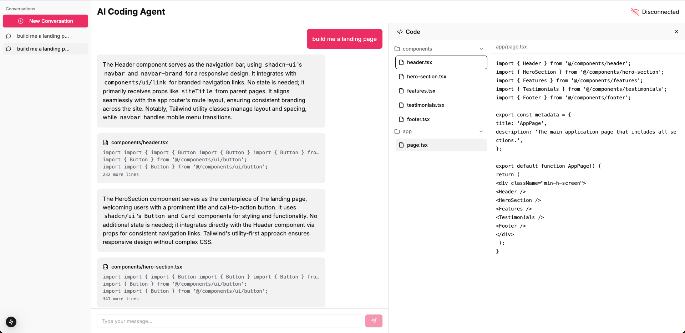

# AI Coding Agent

A modern AI-powered coding assistant that generates and deploys code to a secure sandbox in real-time through natural language conversations. Built with Cerebrium and E2B, this system provides an intuitive interface for turning your ideas into working code in no time.



## ✨ Key Features

- **Real-time Code Generation**: Watch as code is generated instantly as you describe your needs
- **Live Preview**: See your code running in a sandboxed environment
- **File Tree Navigation**: Browse generated files with ease

## 🛠 How It Works

1. **Describe Your Needs**: Start a conversation with the agent about what you want to build
2. **Watch Code Generation**: See code being written in real-time with syntax highlighting
3. **Preview Instantly**: Click the preview link to see your code running live

## 🚀 Tech Stack

- **Frontend**: Next.js 14, TypeScript, Tailwind CSS, shadcn/ui (Access the frontend code, [here](https://github.com/CerebriumAI/example-ai-coding-agent))
- **Backend**: FastAPI, WebSocket for real-time communication
- **LLM**: Qwen 2.5 7B models for code generation running on Cerebrium cloud infrastructure
- **Preview**: Sandboxed environment for secure code execution running on E2B

## 🚦 Limitations

- LLMs are capable of hallucinating. As we're using a large language model with half-precision, it may generate code that doesn't work as expected. Please review the generated code before running it in a production environment.

## 📦 Quick Start

```bash
# Clone the repository
git clone https://github.com/CerebriumAI/examples.git

# Deploy AI coding agent example to cerebrium
cd examples/8-application-demos/4-ai-coding-agent
cerebrium deploy -y

# Connect to your deployed socket endpoint and start sending messages
```

## 📚 Resources

- Check out the full blog post, [here](https://www.cerebrium.ai/blog/building-a-real-time-coding-assistant)
- Frontend code repository can be found, [here](https://github.com/CerebriumAI/example-ai-coding-agent)
